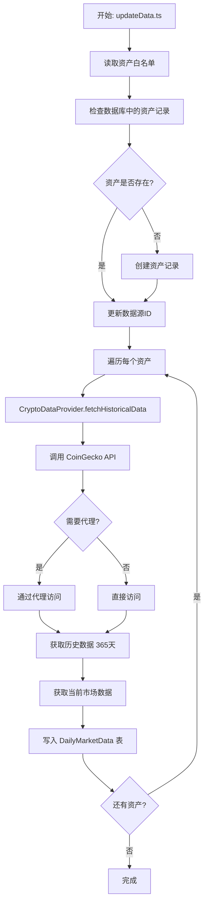
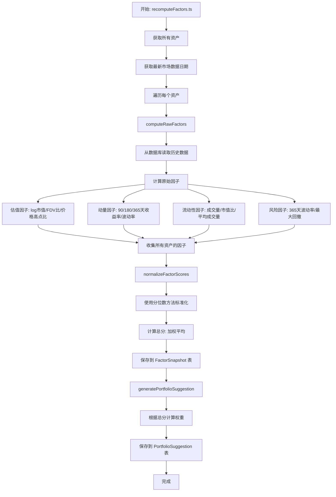
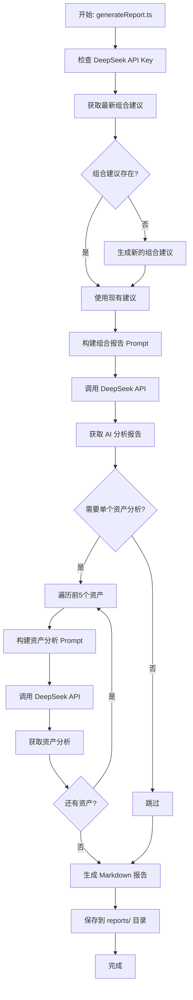

# AI Long-Term Crypto Selector - 项目架构与运作原理

## 📋 目录

1. [系统架构概览](#系统架构概览)
2. [核心工作流程](#核心工作流程)
3. [数据流图](#数据流图)
4. [模块详解](#模块详解)
5. [技术栈说明](#技术栈说明)

---

## 系统架构概览

```
┌─────────────────────────────────────────────────────────────────┐
│                        用户界面层 (Frontend)                      │
│  ┌───────────────────────────────────────────────────────────┐  │
│  │  Next.js App Router                                       │  │
│  │  - Dashboard (资产池表格、组合建议)                        │  │
│  │  - 资产详情页 (K线图、因子分析)                           │  │
│  │  - API Routes (数据接口)                                  │  │
│  └───────────────────────────────────────────────────────────┘  │
└─────────────────────────────────────────────────────────────────┘
                              ↕ HTTP/API
┌─────────────────────────────────────────────────────────────────┐
│                      业务逻辑层 (Server)                          │
│  ┌──────────────┐  ┌──────────────┐  ┌──────────────┐          │
│  │ 数据提供器   │  │ 因子计算引擎  │  │ 策略引擎     │          │
│  │ DataProvider │→ │ FactorEngine │→ │ Strategy     │          │
│  └──────────────┘  └──────────────┘  └──────────────┘          │
│         ↓                  ↓                  ↓                 │
│  ┌───────────────────────────────────────────────────────────┐  │
│  │                    LLM 集成层 (DeepSeek)                   │  │
│  │  - 资产分析 Prompt                                         │  │
│  │  - 组合报告 Prompt                                         │  │
│  └───────────────────────────────────────────────────────────┘  │
└─────────────────────────────────────────────────────────────────┘
                              ↕ Prisma ORM
┌─────────────────────────────────────────────────────────────────┐
│                      数据持久层 (Database)                        │
│  ┌──────────────┐  ┌──────────────┐  ┌──────────────┐          │
│  │ Asset        │  │ DailyMarket  │  │ Factor       │          │
│  │ (资产表)     │  │ Data         │  │ Snapshot     │          │
│  │              │  │ (市场数据)   │  │ (因子快照)   │          │
│  └──────────────┘  └──────────────┘  └──────────────┘          │
│  ┌───────────────────────────────────────────────────────────┐  │
│  │ PortfolioSuggestion (组合建议表)                          │  │
│  └───────────────────────────────────────────────────────────┘  │
└─────────────────────────────────────────────────────────────────┘
                              ↕ HTTP/API
┌─────────────────────────────────────────────────────────────────┐
│                      外部数据源 (External APIs)                   │
│  ┌──────────────┐  ┌──────────────┐                            │
│  │ CoinGecko    │  │ DeepSeek API │                            │
│  │ (价格数据)   │  │ (AI分析)     │                            │
│  └──────────────┘  └──────────────┘                            │
└─────────────────────────────────────────────────────────────────┘
```

---

## 核心工作流程

### 1. 数据采集流程 (`pnpm update-data`)



### 2. 因子计算流程 (`pnpm recompute-factors`)



### 3. AI 报告生成流程 (`pnpm generate-report`)



### 4. 前端展示流程

```mermaid
graph TD
    A[用户访问 Dashboard] --> B[Next.js Server Component]
    B --> C[调用 /api/assets]
    C --> D[Prisma 查询数据库]
    D --> E[返回资产数据 + 因子得分]
    E --> F[渲染资产表格]
    F --> G[用户点击资产详情]
    G --> H[调用 /api/asset/[id]]
    H --> I[Prisma 查询单个资产]
    I --> J[返回价格历史 + 因子数据]
    J --> K[渲染 K线图 + 雷达图]
    K --> L[用户查看组合建议]
    L --> M[调用 /api/portfolio]
    M --> N[Prisma 查询组合建议]
    N --> O[渲染权重分布]
```

---

## 数据流图

### 完整数据流

```
外部数据源 (CoinGecko)
    │
    │ HTTP/API (支持代理)
    ↓
┌─────────────────────────────────┐
│  CryptoDataProvider             │
│  - fetchHistoricalData()        │
│  - fetchCurrentMarketData()     │
└─────────────────────────────────┘
    │
    │ 原始市场数据
    ↓
┌─────────────────────────────────┐
│  DailyMarketData (数据库表)      │
│  - price, marketCap, volume      │
│  - date, high, low, open         │
└─────────────────────────────────┘
    │
    │ 历史数据查询
    ↓
┌─────────────────────────────────┐
│  FactorEngine                   │
│  - computeRawFactors()          │
│  - normalizeFactorScores()     │
└─────────────────────────────────┘
    │
    │ 因子得分 (0-5分)
    ↓
┌─────────────────────────────────┐
│  FactorSnapshot (数据库表)      │
│  - valuationScore               │
│  - momentumScore                │
│  - liquidityScore               │
│  - riskScore                    │
│  - totalScore                   │
└─────────────────────────────────┘
    │
    │ 因子得分
    ↓
┌─────────────────────────────────┐
│  Strategy Engine                │
│  - calculateTargetWeight()      │
│  - generatePortfolioSuggestion()│
└─────────────────────────────────┘
    │
    │ 权重分配
    ↓
┌─────────────────────────────────┐
│  PortfolioSuggestion (数据库表) │
│  - assetId, targetWeight         │
│  - date                          │
└─────────────────────────────────┘
    │
    │ 组合建议 + 因子数据
    ↓
┌─────────────────────────────────┐
│  DeepSeek LLM                   │
│  - buildPortfolioReportPrompt() │
│  - buildAssetAnalysisPrompt()   │
└─────────────────────────────────┘
    │
    │ AI 分析报告
    ↓
┌─────────────────────────────────┐
│  reports/portfolio-YYYY-MM-DD.md│
└─────────────────────────────────┘
    │
    │ 所有数据
    ↓
┌─────────────────────────────────┐
│  Frontend Dashboard             │
│  - 表格展示                     │
│  - 图表可视化                   │
│  - 报告展示                     │
└─────────────────────────────────┘
```

---

## 模块详解

### 1. 数据层 (Data Layer)

#### 1.1 数据提供器 (`src/server/data-providers/`)

```
IDataProvider (接口)
    │
    └── CryptoDataProvider (实现)
        ├── fetchUniverse()          # 获取资产池
        ├── fetchHistoricalData()    # 获取历史数据
        └── fetchCurrentMarketData() # 获取当前数据
```

**职责：**
- 封装外部 API 调用（CoinGecko）
- 处理代理配置
- 数据格式转换

#### 1.2 数据库模型 (`prisma/schema.prisma`)

```
Asset (资产表)
├── id, symbol, name
├── assetClass, dataSourceId
└── 关联关系
    ├── dailyMarketData (1:N)
    ├── factorSnapshots (1:N)
    └── portfolioSuggestions (1:N)

DailyMarketData (市场数据表)
├── assetId, date
├── price, marketCap, volume
└── fdv, high, low, open

FactorSnapshot (因子快照表)
├── assetId, date
├── valuationScore, momentumScore
├── liquidityScore, riskScore
└── totalScore, rawFactors (JSON)

PortfolioSuggestion (组合建议表)
├── assetId, date
└── targetWeight, notes
```

### 2. 因子计算层 (Factor Layer)

#### 2.1 因子定义 (`src/server/factors/factorDefinitions.ts`)

```typescript
RawFactors {
  // 估值因子
  logMarketCap: number
  fdvToMarketCapRatio: number
  priceToHigh365d: number
  
  // 动量因子
  return90d, return180d, return365d: number
  volatility90d, volatility180d: number
  
  // 流动性因子
  volumeToMarketCapRatio: number
  avgDailyVolume30d: number
  
  // 风险因子
  volatility365d: number
  maxDrawdown365d: number
}

FactorScores {
  valuationScore: number  // 0-5
  momentumScore: number   // 0-5
  liquidityScore: number  // 0-5
  riskScore: number       // 0-5
  totalScore: number      // 0-5
}
```

#### 2.2 因子计算 (`src/server/factors/computeFactors.ts`)

**计算步骤：**
1. 从数据库读取历史数据（至少 365 天）
2. 计算原始因子值
3. 使用分位数方法标准化（基于所有资产）
4. 加权平均计算总分

**权重分配：**
- 估值：25%
- 动量：30%
- 流动性：20%
- 风险：25%

### 3. 策略层 (Strategy Layer)

#### 3.1 评分规则 (`src/server/strategy/scoring.ts`)

```
总分阈值 → 目标权重映射：
- ≥ 4.0  → 4%
- 3.5-4.0 → 2%
- 3.0-3.5 → 1%
- < 3.0  → 0% (不持有)
```

#### 3.2 组合建议 (`src/server/strategy/portfolio.ts`)

**流程：**
1. 获取所有资产的因子得分
2. 根据评分规则计算目标权重
3. 归一化权重（确保总权重 ≤ 100%）
4. 保存到数据库

### 4. LLM 集成层 (LLM Layer)

#### 4.1 DeepSeek 客户端 (`src/server/llm/deepseekClient.ts`)

```typescript
DeepSeekClient {
  chat(messages, options)      # 调用 API
  chatSimple(userMessage)      # 简化调用
}
```

#### 4.2 Prompt 模板

**资产分析 Prompt：**
- 输入：资产信息 + 因子得分 + 原始因子值
- 输出：多维度分析（估值、动量、流动性、风险）

**组合报告 Prompt：**
- 输入：组合建议 + 资产配置
- 输出：Markdown 格式投资组合分析报告

### 5. 前端层 (Frontend Layer)

#### 5.1 页面结构

```
/app
├── page.tsx              # 主 Dashboard
│   ├── 资产池表格
│   └── 组合建议标签页
│
└── assets/[id]/page.tsx  # 资产详情页
    ├── 概览标签
    ├── 价格走势标签 (K线图)
    └── 因子分析标签 (雷达图)
```

#### 5.2 API 路由

```
/api
├── assets/route.ts        # GET: 获取所有资产数据
├── portfolio/route.ts     # GET: 获取组合建议
├── asset/[id]/route.ts    # GET: 获取单个资产详情
└── report/route.ts        # GET: 获取最新报告
```

---

## 技术栈说明

### 后端技术

| 技术 | 用途 |
|------|------|
| **Next.js 14** | 全栈框架，Server Components + API Routes |
| **TypeScript** | 类型安全 |
| **Prisma** | ORM，数据库操作 |
| **SQLite** | 开发环境数据库 |
| **Axios** | HTTP 客户端 |
| **https-proxy-agent** | 代理支持 |

### 前端技术

| 技术 | 用途 |
|------|------|
| **React 18** | UI 框架 |
| **TailwindCSS** | 样式框架 |
| **shadcn/ui** | UI 组件库 |
| **Recharts** | 图表库 |
| **react-markdown** | Markdown 渲染 |

### 外部服务

| 服务 | 用途 |
|------|------|
| **CoinGecko API** | 加密货币价格数据 |
| **DeepSeek API** | AI 分析报告生成 |

---

## 典型使用场景

### 场景 1：每日数据更新

```bash
# 1. 拉取最新数据
pnpm update-data
# → 调用 CoinGecko API
# → 写入 DailyMarketData 表

# 2. 计算因子
pnpm recompute-factors
# → 从 DailyMarketData 读取数据
# → 计算因子得分
# → 写入 FactorSnapshot 表
# → 生成组合建议
# → 写入 PortfolioSuggestion 表

# 3. 生成 AI 报告
pnpm generate-report
# → 从数据库读取组合建议
# → 调用 DeepSeek API
# → 生成 Markdown 报告
```

### 场景 2：查看 Dashboard

```
用户访问 http://localhost:3000
    ↓
Next.js Server Component 渲染
    ↓
调用 /api/assets 获取数据
    ↓
Prisma 查询数据库
    ↓
返回 JSON 数据
    ↓
渲染表格和图表
```

---

## 关键设计决策

### 1. 为什么使用 SQLite？

- **开发环境**：简单，无需额外服务
- **生产环境**：可轻松切换到 PostgreSQL
- **数据量**：长期投资，数据量不大

### 2. 为什么手动触发？

- **低频投资**：不需要实时数据
- **成本控制**：避免频繁 API 调用
- **灵活性**：用户控制更新时机

### 3. 为什么使用分位数标准化？

- **相对评分**：基于资产池内比较
- **动态调整**：随市场变化自动调整
- **公平性**：避免绝对值偏差

### 4. 为什么支持代理？

- **中国用户**：CoinGecko 可能被墙
- **灵活性**：支持各种代理工具
- **环境变量**：不硬编码，便于配置

---

## 扩展性设计

### 未来支持 A 股/美股

```
IDataProvider (接口)
├── CryptoDataProvider (当前实现)
├── USEquityDataProvider (未来)
└── CNEquityDataProvider (未来)

Asset.assetClass
├── 'crypto' (当前)
├── 'us_equity' (未来)
└── 'cn_equity' (未来)
```

### 因子计算扩展

- 不同资产类别可使用不同因子
- 因子权重可配置
- 支持自定义因子

---

## 总结

这是一个**数据驱动的长期投资决策系统**，核心流程：

1. **数据采集** → 从 CoinGecko 获取市场数据
2. **因子计算** → 基于历史数据计算投资因子
3. **策略执行** → 根据因子得分生成组合建议
4. **AI 分析** → 使用 DeepSeek 生成专业报告
5. **可视化展示** → 前端 Dashboard 展示结果

整个系统采用**分层架构**，各模块职责清晰，便于维护和扩展。

